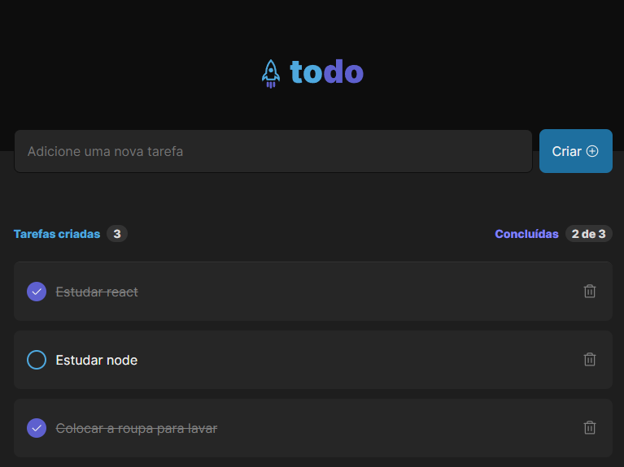

# Neewe feed [🔗Clique para acessar o projeto](https://todo-vm.netlify.app/)

# > Desafio 1 Ignite

Projeto de front-end desenvolvido por meio do primeiro desafio da trilha de React.js do curso Ignite da Rocketseat.

## 🛠️ Tecnologias.
- React.js
- Css
- Vite  
-localStorage
- Git e Github